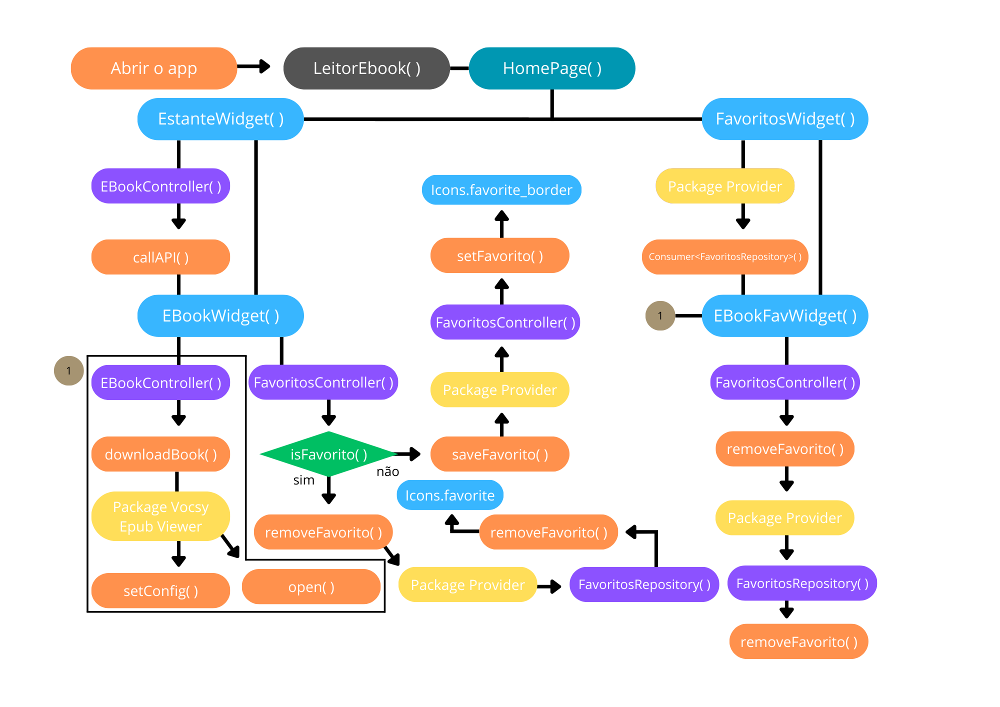
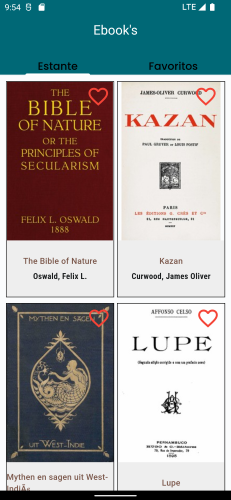
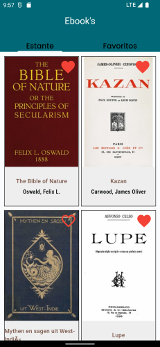
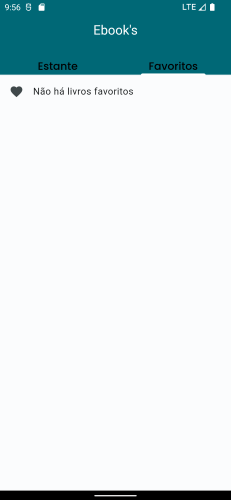
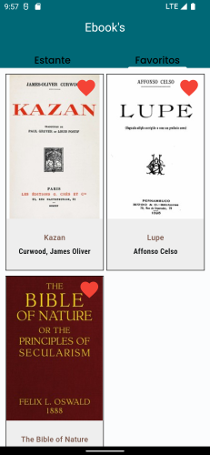

# Bem vindo ao projeto

Esse repositório é dedicado a um teste técnico para a [Escribo](https://escribo.com/). Está uma empresa voltada para a educação infantil com jogos pedagógicos, altamente estimulantes para o amadurecimento da educação.
Fiquei muito contente com o contato sobre a vaga de Flutter Iniciante e espero que fiquem satisfeitos com meu segundo teste.

## Breve resumo
Agora vamos para a parte que interessa. 
Desenvolvi uma estruturada aplicação com baseada em Flutter e Dart, consumindo a API apresentada no desafio para poder apresentar o projeto. Se trata de um app para ler e-books, ele utiliza o package Vocsy Epub Viewer para abrir o e-book e utiliza o package Provider para dar reatividade ao app quanto ao função de favoritos.

## Rápido esquema do funcionamento do app

## Pacotes de dependências do app

1. transparent_image
   1. Versão: 2.0.1
   2. Função: Dar efeito de fade ao carregar a capa dos livros.
2. google_fonts
   1. Versão: 6.1.0
   2. Função: Estilizar as fontes dos textos.
3. dio
   1. Versão: 5.4.0
   2. Função: Fazer o download dos livros no arquivo criado.
4. path_provider
   1. Versão: 2.1.1
   2. Função: Retornar os diretórios os quais irão ficar os arquivos dos livros.
5. path
   1. Versão: 1.8.3
   2. Função: Instanciar um arquivo e retornar o caminho do mesmo com o diretório fornecido pelo package SQFlite.
6. vocsy_epub_viewer
   1. Versão: 2.0.0
   2. Função: Abrir os livros no formato .epub disponibilizados pela API.
7. sqflite
   1. Versão: 2.3.0
   2. Função: Fornecer um diretório para a criação do banco de dados, criar um banco de dados no arquivo criado pelo package Path dentro diretório fornecido e fornecer os meios necessários para a manipulação desses dados.
8. provider
   1. Versão: 5.0.0
   2. Função: Fornecer a reatividade ao app com relação a função favoritar, assim retomando eles na aba "Favoritos" e fornecendo um feedback visual com o coração (indicador de favoritos) preenchido.

## Screenshots  
 
##
 

Nessas screenshots do app, você poderá visualizar sua estante de livros digitais e uma parte dedicada aos seus livros favoritos.

## Chegou a melhor parte !!!
### Vamos testar!?
Para isso, é muito simples, basta você:
* Acesse o link [link do apk no Google Drive](https://drive.google.com/file/d/1Q7opCZ4FlEUwgE7-WT3gqCuPRYn3c1GK/view?usp=sharing).
* Baixe o apk no seu telefone android
* Acesse a pasta de download nos aquivos do seu telefone
* Instale o apk

**Perfeito!** Ao instalar você poderá utilizar o meu app em seu telefone android.